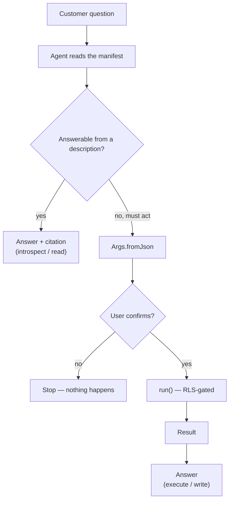
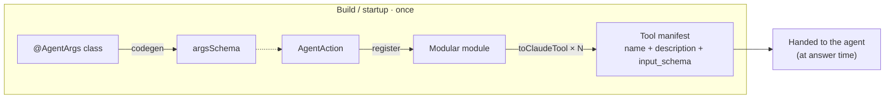
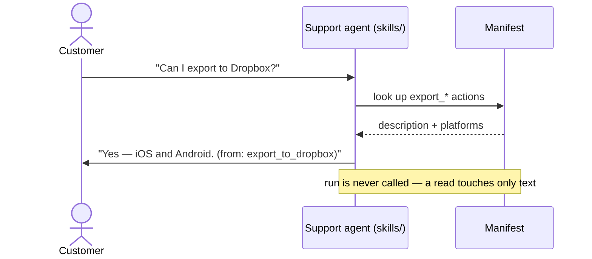

# Agentic Protocol


## Core Principle

**Define every capability once, as a self-documenting, strongly-typed action, and let the UI, a remote API, and an AI agent all drive it through the same code path.** No second implementation, no drifting copy, no screen-scraping.

For customer support this matters because the same definition that powers the button a user taps is the definition a support agent reads to answer *"can the app do this, and how?"* — and, where governed, to *do* it on the user's behalf. The source of truth is the action itself.

The question for every part of this protocol: **is this capability defined exactly once, and can both a human and an agent reach it through that single definition?**

### Glossary (5 terms used throughout)

- **Action** — one self-documenting capability: `name` + `description` + typed arguments + `run`.
- **Registry** — the set of actions registered across feature modules at app startup.
- **Manifest** — the JSON the agent actually reads: one `{name, description, input_schema}` entry per action, emitted from the registry.
- **Tool shape** — a single action rendered into the format an LLM expects (`toClaudeTool`).
- **Introspect vs execute** — *read* the manifest to answer a question, vs *call* `run` to perform an action on the user's behalf.

---

## 1. The Problem

Construculator helps construction professionals build cost estimates, collaborate, and export to cloud storage. The facts a support agent needs to answer a customer are scattered and implicit:

- **Capability/availability** ("Can I export to Dropbox?") lives in feature modules, route registration, DI wiring, and feature flags.
- **Behavior** ("Why didn't my total update after my teammate's offline edit?") lives in use cases, repository implementations, and PowerSync sync rules.
- **None of it** is written anywhere a support agent can consult, and any FAQ we hand-write drifts the moment we ship.

The deeper problem is structural: **SaaS and raw agents each solve only half.** A polished UI walls the agent out; a raw agent has no durable, domain-shaped actions to call. The fix is to stop treating the agent as a bolt-on and instead expose the app's real capabilities through one shared action layer.

---

## 2. The Idea — "Define Once, Deploy Everywhere" in Dart

The unit of the protocol is a **self-documenting action**: a single class that bundles three things that normally live apart —

1. a **description** (what the AI and the support agent read),
2. **strongly-typed arguments** (the schema guardrail), and
3. the **execution logic** (`run`).

**Dart's type system is the guardrail — for free.** If a developer wires this action into a Flutter widget and forgets a required argument, the code does not compile. The same typed definition is what an agent calls remotely via `fromJson`.

### Reference shape

Here is the shape in **our** domain and stack — Construculator's estimation feature, `Either`-based failures, and our use-case layer:

```dart
// lib/libraries/agent_action/agent_action.dart

import 'package:construculator/libraries/either/either.dart';

/// A single, self-documenting system action that can be driven by the UI,
/// a remote API, or an AI agent — defined once, deployed everywhere.
abstract class AgentAction<TArgs, TResult> {
  const AgentAction();

  /// Stable identifier — used as the AI tool name and the registry key.
  String get name;

  /// Human- and AI-readable description. This is the exact text a support
  /// agent reads to answer "what can the app do?", and the tool description
  /// an LLM sees. One sentence, behavioural, no implementation detail.
  String get description;

  /// JSON Schema for [TArgs]. Generated at build time (see §6 — Flutter has
  /// no dart:mirrors, so this is NOT runtime reflection).
  Map<String, dynamic> get argsSchema;

  /// Execution logic. Returns Either so failures are typed values, not throws —
  /// matching our domain-layer convention.
  Future<Either<Failure, TResult>> run(TArgs arguments);
}
```

```dart
// lib/features/estimation/.../actions/add_cost_item_action.dart

/// The strict schema guardrail. An agent or API constructs this from JSON;
/// a widget constructs it directly — both are compile-time checked.
class AddCostItemArgs {
  final String estimateId;
  final String description;
  final double quantity;
  final double unitCost;

  const AddCostItemArgs({
    required this.estimateId,
    required this.description,
    required this.quantity,
    required this.unitCost,
  });

  factory AddCostItemArgs.fromJson(Map<String, dynamic> json) => AddCostItemArgs(
        estimateId: json['estimateId'] as String,
        description: json['description'] as String,
        quantity: (json['quantity'] as num).toDouble(),
        unitCost: (json['unitCost'] as num).toDouble(),
      );
}

/// The single source of truth for "Add a cost item to an estimate".
/// Note it does NOT re-implement business logic — it delegates to the existing
/// domain use case, so the action is a thin self-documenting facade.
class AddCostItemAction extends AgentAction<AddCostItemArgs, void> {
  final AddCostItemUseCase _addCostItem;
  const AddCostItemAction(this._addCostItem);

  @override
  String get name => 'add_cost_item';

  @override
  String get description =>
      'Add a labor, material, or equipment line item to a cost estimate.';

  @override
  Map<String, dynamic> get argsSchema => _$AddCostItemArgsSchema; // generated

  @override
  Future<Either<Failure, void>> run(AddCostItemArgs args) => _addCostItem(
        estimateId: args.estimateId,
        description: args.description,
        quantity: args.quantity,
        unitCost: args.unitCost,
      );
}
```

The key adaptation to our architecture: **an `AgentAction` wraps the canonical operation, it does not replace it.** Where a feature has a `UseCase`, the action delegates to it; where a bloc calls the repository directly (as several of ours do), the action calls that same path. The action adds only the self-documenting envelope and the typed argument boundary — never a second copy of the logic. The one rule: if a guard or validation currently lives *inside* a bloc, extract it so the bloc and the action share it. That shared single implementation is what gives the UI, the API, and the agent the same code path.

---

## 3. What the Unified Action Model gives us

- **AI tool generation.** A small helper turns any action into the tool shape an LLM consumes — name, description, and input schema:

  ```dart
  /// Anthropic/Claude tool-use shape: {name, description, input_schema}.
  Map<String, dynamic> toClaudeTool(AgentAction action) => {
        'name': action.name,
        'description': action.description,
        'input_schema': action.argsSchema,
      };
  ```

  Register N actions in a Modular module → emit N tools → the agent now knows exactly what the app can do, in the app's own words.
- **Unified state: and this is where our stack shines.** When `run` writes to the database, the UI updates automatically — whether a human clicked a button or an AI triggered the action. We get this via **PowerSync** (`lib/libraries/powersync`): `run` writes through the repository to the local SQLite mirror, and any **Bloc** subscribed to the corresponding PowerSync watch-query rebuilds instantly. Human tap and agent call converge on the same reactive stream.
- **Governed execution.** Because actions run through the user's authenticated session, **Supabase RLS** enforces that an agent can never exceed the user's permissions — governance comes from the same policies that guard the UI. The user's identity is bound to that session out-of-band; it is **never** a tool argument the agent fills in, so the LLM never sees the auth token and cannot act as a different user.

---

## 4. What the End Product Looks Like

Before the next sections get into scope and codegen, here is the running picture. The key thing to hold onto: the agent does not crawl our code — at runtime it reads a **manifest** generated from the actions.

### The high-level loop



### The registry is a manifest, built once — nothing crawls the code

The "registry" is **not** a live search over `lib/`. At build/startup time each feature module registers its `AgentAction`s; the `toClaudeTool` helper (§3) turns that set into one JSON **manifest** — a flat list of `{name, description, input_schema}`. That manifest *is* the app's self-description. The agent reads the manifest, never the source.



Add an action → it appears in the manifest; change a description → the manifest changes with it. No reflection, no code crawling, and — because the manifest is generated once rather than per question — **no per-request cost** to discovering what the app can do.

### Where the agent lives

The agent runs inside our `skills/` agentic framework: the skill is the host that loads the manifest and runs the question→answer loop above. The plan covers two shapes:

| Shape | Where it runs | How it reaches actions | Primary use |
|---|---|---|---|
| **In-app assistant** | inside the Flutter app | holds the registry in-process; calls `run` directly | "do it for me" inside the product |
| **Remote support agent** | server-side (a support tool) | holds the **exported JSON manifest**; reads answer from descriptions, writes call back via API → `fromJson` → `run`, executed inside the user's authenticated Supabase session | the customer-support use case |

For support the first milestone is **read-only** (§5): answering *"can the app do X?"* needs only the manifest, so it ships with zero execution risk.

### Walkthrough 1 — a read (introspect) question



The agent answers from the action's `description` and cites which action it read. **`run` is never called** — a read touches only text, so it cannot change anything, and every answer is traceable to a source.

### Walkthrough 2 — an execute request (gated)

```mermaid
sequenceDiagram
    actor Customer
    participant Agent as Agent (skills/)
    participant Supabase as Supabase (RLS)

    Customer->>Agent: "Add a $500 concrete line"
    Note over Agent: pick add_cost_item<br/>Args.fromJson(JSON)
    Agent->>Customer: "Add $500 concrete to estimate #42?"
    Customer->>Agent: Confirm
    Agent->>Supabase: run(args)
    Note over Supabase: RLS scopes the write<br/>to THIS user's session
    Supabase-->>Agent: Either&lt;Failure, T&gt;
    Agent->>Customer: "Done." / "Couldn't — not permitted."
```

**Security — identity is bound to the session, never a tool argument.** The agent calls `add_cost_item(estimateId, quantity, …)` — notice there is no `userId`. It never sees the user's auth token and cannot pass an arbitrary user id. `run` executes inside the user's authenticated Supabase session, and **Supabase RLS** scopes every write to that user at the database. So a write is protected by **two independent gates**: explicit user confirmation (product-level) and RLS (database-level). Even a malicious instruction — *"add a line to someone else's estimate"* — cannot exceed what the user could already do in the UI.

---

## 5. Scope — What the Support Agent Does With This

The Unified Action Model is the foundation; **customer support is its first consumer.** A support agent uses the action **registry** in two modes:

| Mode | What it does | Example | Risk |
|---|---|---|---|
| **Introspect (read)** | Reads action `name` + `description` + `argsSchema` to answer capability & behavior questions | "Can I export to Dropbox?" → is `export_to_dropbox` registered, on which platforms, what does its description say? | Low — safe to ship first |
| **Execute (write)** | Calls `run` on the user's behalf, behind explicit confirmation | "Add a $500 concrete line item" → `add_cost_item` | Higher — gate behind approval (see governance) |

### In scope (answerable from the action registry)

| Class | Example |
|---|---|
| **Capability / availability** | "Can I export to Dropbox?" "Is offline sync on Android?" |
| **Behavior / how-it-works** | "Why isn't my total updating?" "What happens to shared edits made offline?" |

### Out of scope (state explicitly; the agent must defer, never fabricate)

| Class | Why it's out |
|---|---|
| **Account / billing / plan** | Lives in Supabase/backend & billing, not in app actions |
| **Live runtime troubleshooting** | Needs observability (Sentry/PostHog) + the user's live session, not static action definitions |

**Governance is non-negotiable for support:** every answer traces to the action(s) it read, and out-of-scope questions are detected and routed elsewhere rather than answered. This is the principle of *governed, auditable execution* — and for a tool where a wrong cost line has real financial consequences, it matters more than raw parity.

---

## 6. The One Real Flutter Constraint 

The obvious approach — a helper that reads the `Args` properties at runtime to output a JSON schema — assumes **runtime reflection**. **That does not work in Flutter — `dart:mirrors` is unavailable in AOT/Flutter builds.** So `argsSchema` cannot be derived by reflecting over the class at runtime.

The idiomatic Dart answer is **build-time code generation**, which we already do (`build.yaml`, `custom_lint`, the `@dataModel` annotation in `lib/libraries/annotations`). The plan:

1. Annotate the `Args` class (e.g. `@AgentArgs()`).
2. A `source_gen` builder emits a `_$XxxArgsSchema` constant — the JSON Schema — at build time from the constructor's typed parameters.
3. The action exposes it via `argsSchema`.

This keeps the developer experience we want ("just define the typed class") while respecting how Flutter actually compiles. It also gives us a natural **drift guard**: the generator fails the build if an action's args and its declared schema diverge — the same custom_lint muscle we already use for `@dataModel`.

---

## 7. Recommended Direction

1. **Adopt `AgentAction<TArgs, TResult>` as the unified action layer**, with actions as thin self-documenting facades over existing domain use cases. One definition; UI, API, and agent share it.
2. **Generate AI tool schemas at build time** via `source_gen` (no `dart:mirrors`), reusing our existing codegen pipeline.
3. **Make support the first consumer in read-only (introspection) mode** — lowest risk, immediate value, proves the registry-as-source-of-truth idea before any agent writes data.
4. **Gate all agent execution** behind Supabase RLS (automatic) + explicit user confirmation (product-level).
5. **Converge with FaB** ([CA-522](https://ripplearc.youtrack.cloud/issue/CA-522)): a Feature Manifest can declare its actions, so the `AgentAction` set becomes generated from the blueprint — the long-term zero-drift end-state. Design the action/args schema to map onto a manifest field now so we never fork.

---

## 8. Next Tasks (Prioritized Backlog)

To be re-created as real tickets under epic [CA-738](https://ripplearc.youtrack.cloud/issue/CA-738) once this direction is approved.

### P1 — Prove the action model on one capability
1. **Define `AgentAction<TArgs, TResult>` and the action contract** in a shared library (`lib/libraries/agent_action`): `name`, `description`, `argsSchema`, `run → Either<Failure, T>`. *(~2 pts)*
2. **Build the `source_gen` schema builder** that emits `argsSchema` from a typed `Args` class at build time (no `dart:mirrors`); reuse the `build.yaml`/custom_lint pipeline. *(~3 pts)*
3. **Implement ONE real action end-to-end** as a facade over an existing use case — recommend `add_cost_item` (write, in-domain) or `export_to_dropbox` (clear customer yes/no). *(~1 pt)*

### P2 — Make it consumable and honest
4. **`toClaudeTool` + action registry** — register actions via Modular DI and emit the tool list an LLM consumes. *(~2 pts)*
5. **`skills/answer-support-question` skill (PoC)** — given a customer question, introspect the registry and answer capability/behavior questions *with a citation to the action(s) read*; explicitly defer out-of-scope (account/billing/runtime). Read-only mode only. *(~3 pts)*
6. **Drift guard** — build/lint fails when an action's declared schema diverges from its `Args`; reuses existing custom_lint traversal. *(~2 pts)*

### P3 — Execution, convergence, scale
7. **Gated execution path** — allow the agent to call `run` behind explicit user confirmation; verify RLS boundaries hold. *(~3 pts)*
8. **Converge with FaB Feature Manifests** ([CA-522](https://ripplearc.youtrack.cloud/issue/CA-522)) — generate the action set from blueprints.
9. **Roll out across feature modules** (estimation → global search → members → project) once proven on one.
10. **(Separate epic) Customer-facing channel** — wiring the support skill into an actual helpdesk/chat surface is its own initiative, not part of this protocol.

---

## Related

- Epic: [CA-738 — Agentic Protocol: Codebase-Embedded State Extraction for Customer Support](https://ripplearc.youtrack.cloud/issue/CA-738)
- This doc's ticket: [CA-744](https://ripplearc.youtrack.cloud/issue/CA-744)
- Parent framework: [CA-522 — Feature as a Blueprint (FaB)](https://ripplearc.youtrack.cloud/issue/CA-522)
- Codebase anchors: `lib/libraries/annotations/data_model.dart` (annotation + custom_lint + codegen precedent), `lib/libraries/either` (`Either<Failure, T>`), `lib/libraries/powersync` (reactive shared state), `skills/` (agentic skills framework), Supabase RLS (governed access), `build.yaml` (source_gen pipeline).
- External: Builder.io, *Agent-Native Architecture* — the "Define Once, Deploy Everywhere" action model this doc expresses in Dart.
