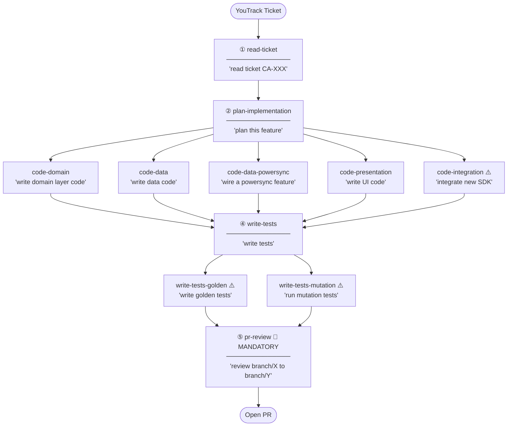

# Agentic Skills Plan — Story Lifecycle Edition

## Quick Setup

**YouTrack MCP** — each dev sets this up once with their personal token. Without it, `read-ticket` falls back to asking you to paste the ticket manually (still works, just slower).

→ Follow the setup guide: https://www.jetbrains.com/help/youtrack/cloud/model-context-protocol-server.html#remote-mcp-client

---

## Core Principle

When a coding agent (Cursor, Claude Code) invokes a skill, it loads the entire `SKILL.md` into its context window. Every line costs tokens whether the agent needs it or not. A skill that bundles unrelated behaviors forces the agent to read past irrelevant content — and risks it anchoring on the wrong pattern for the moment.

The question to ask for every skill: **what is the agent's single verb right now?**

Two tests determine skill boundaries:
1. Does every rule in this skill apply at the same moment in the workflow?
2. Is this skill always invoked, or only sometimes?

If the answer to either is no, that's a signal to split. The number of skills is an output of those answers, not a target set upfront.

Skills are not advisory tools for humans. They are **construction briefs** prescriptive enough that the agent can follow them without asking clarifying questions, generating correct code from the start.

---

## Skill Architecture

```
skills/
├── read-ticket/              # Stage 1: Intake
├── plan-implementation/      # Stage 2: Planning
├── code-presentation/        # Stage 3: Coding — UI layer
├── code-domain/              # Stage 3: Coding — Domain layer
├── code-data/                # Stage 3: Coding — Data layer (Supabase)
├── code-data-powersync/      # Stage 3: Coding — Data layer (PowerSync/offline-first)
├── code-integration/         # Stage 3: Coding — 3rd party (gated)
├── write-tests/              # Stage 4: Testing — unit + widget (always)
├── write-tests-golden/       # Stage 4: Testing — screenshot (gated)
├── write-tests-mutation/     # Stage 4: Testing — mutation (gated)
└── pr-review/                # Stage 5: Review (mandatory)
```

---

## Workflow at a Glance



> ⚠️ = gated skill — only triggered when its gate condition is met (see Stage details below).

---

## Trigger Words

Say these exact phrases to activate each skill. Imprecise phrasing may not trigger the right skill.

| Skill | Trigger phrase |
|-------|---------------|
| `read-ticket` | `read ticket CA-123` |
| `plan-implementation` | `plan this feature` |
| `code-domain` | `write domain layer code` |
| `code-data` | `write data code` |
| `code-data-powersync` | `wire a powersync feature` |
| `code-presentation` | `write UI code` |
| `code-integration` ⚠️ | `integrate new SDK` |
| `write-tests` | `write tests` |
| `write-tests-golden` ⚠️ | `write golden tests` |
| `write-tests-mutation` ⚠️ | `run mutation tests` |
| `pr-review` | `review branch/X to branch/Y` |

---

## Stage 1 — Ticket Intake

### `read-ticket` *(always)*

**Verb:** Understand what to build.

The agent's first action when assigned a story. No coding rules live here — this skill is purely about orientation so that every subsequent skill loads with the right context.

**What the agent does:**
- Parses the ticket to identify which architecture layers are touched (presentation / domain / data / integration)
- Identifies what new classes will be needed and their rough responsibilities
- Anticipates which test types will be required (unit, widget, golden, mutation)
- Flags ambiguities in the ticket to surface to the developer before coding begins

**Output:** A shared mental model that primes the planning skill.

---

## Stage 2 — Implementation Planning

### `plan-implementation` *(always)*

**Verb:** Decide what to create.

Covers everything the agent decides before writing the first line of production code. Correctness here eliminates naming and structure rework later.

**What the agent does:**
- Names all new classes using correct suffixes: `UseCase`, `Service`, `Repository`, `Datasource` (RULE_2)
- Applies abstraction-level naming: abstract at UI layer, explicit and concrete at data layer (RULE_11)
- Decides which files to create and where they live in the layer structure
- Identifies any required CoreUI components — if a component doesn't exist, the agent surfaces this to the developer before coding, not after

**What the agent does not do:** Write any implementation code. Planning and coding are separate verbs.

**Output:** Plan saved to `plans/CA-XXX-plan.md` — class names, file paths, CoreUI blockers, PR split strategy, and next skills to invoke.

---

## Stage 3 — Coding

The coding phase splits by architecture layer because each layer has genuinely different concerns. The agent should load only the guidance relevant to the layer it is currently writing.

### `code-presentation` *(always, when story touches UI)*

**Verb:** Write a widget, screen, or BLoC.

BLoC lives here — it is the state coordinator for the screen, not a business rule author.

**Rules applied:**
- **RULE_4** — Use CoreUI components; never reach for Material widgets directly. If no CoreUI equivalent exists, ask the developer rather than substituting silently.
- **RULE_5** — No business logic in widgets: no guard checks, no cross-state coordination, no inline calculations.
- **RULE_10** — All user-facing strings must use localization keys; no hardcoded text.
- **RULE_12** — State derivation belongs in the BLoC, not in the widget's build method.
- **RULE_7** — Self-documenting code: comments explain *why*, not *how*. No AI-generated placeholder comments.

---

### `code-domain` *(always, when story touches domain)*

**Verb:** Write a use case and its repository contract.

These two travel together because in the same session the agent expresses the business intent (use case) and defines the interface the use case depends on (repository contract). No implementation details enter here.

**Rules applied:**
- **RULE_2 / RULE_11** — Naming: use case class names describe business intent; repository interfaces are named at the right abstraction level.
- **RULE_5** — Pure business logic only. No data source concerns, no Flutter framework imports, no Sentry calls.
- **RULE_7** — Self-documenting code; domain logic should read like a business rule, not an algorithm.

**What does not live here:** Stream lifecycle, error logging, SDK wiring — those belong in the layers below.

---

### `code-data` *(always, when story touches data layer)*

**Verb:** Write a repository implementation or datasource.

This is the bridge between the domain contract and the outside world (remote API, local DB, device sensors).

**Rules applied:**
- **RULE_2 / RULE_11** — Concrete, explicit naming: `RemoteUserDatasource`, not `UserDatasourceImpl`.
- **RULE_5** — Repository implementations translate data errors into domain failures; they do not contain business rules.
- **RULE_6** — If the datasource exposes streams: use `distinct()`, manage `StreamController` lifecycle, ensure proper cancellation on dispose.
- **RULE_15** — Sentry error logging lives here for unexpected data errors. Log once — do not re-log errors as they propagate up the call stack. Expected errors (e.g., 404, empty result) are not Sentry events.
- **RULE_7** — Self-documenting code.

---

### `code-integration` *(gated — new 3rd party service)*

**Verb:** Wire an external SDK into the app.

**Decision gate:** Invoke only if this story introduces a new external package or service. If the story only uses an already-integrated SDK, this skill is not needed.

This is a distinct verb because the agent is not writing business logic or UI — it is building an integration seam, which has its own ceremony and failure modes.

**What the agent does:**
- Initializes the SDK in the correct location (DI module, not in a widget or use case)
- Wraps the SDK in an adapter so the domain layer never imports it directly — the domain depends on the repository contract, the adapter implements it
- Translates SDK exceptions into typed domain failures at the adapter boundary
- **RULE_15** — Logs unexpected SDK errors via Sentry once, at the adapter layer only
- **RULE_2 / RULE_11** — Names the adapter and its contract at the correct abstraction level

---

### `code-data-powersync` *(gated — PowerSync-synced tables)*

**Verb:** Write the data layer for an offline-first, PowerSync-synced table.

**Decision gate:** Use this **instead of `code-data`** when the feature reads/writes a table listed in `lib/libraries/powersync/models/schema.dart`. For non-synced Supabase tables, use `code-data`.

**What the agent does:**
- Reads go through `watch()` streams so the UI stays live as sync arrives — not one-shot `getAll()`
- Writes are optimistic local mutations via `execute()`; success means "queued for upload", **not** "server accepted"
- Multi-table atomic writes use `writeTransaction`
- DataSource owns on-demand `syncStream` activation and releases it on cancel (no leak)
- **RULE_15** — RepositoryImpl is the error boundary; DataSource always rethrows

---

## Stage 4 — Testing

Testing splits not by content similarity but by **invocation pattern**: some tests are always written, others are opt-in based on a decision gate. The gate logic is the primary job of the gated skills — it cannot be buried inside a combined test file.

### `write-tests` *(always)*

**Verb:** Write unit and widget tests.

Unit and widget tests stay together because they share the same Modular DI init/destroy setup, the same fake-at-lowest-boundary rule, and are typically written in the same session for the same feature.

**Unit test side:**
- **RULE_3** — Fake the real implementation at the lowest boundary; no mocks or stubs.
- **RULE_9** — Tests assert on behavior (output, state changes, emitted events), never on internal implementation details or method call counts.
- Stream testing: use `expectLater` with matchers, not `await` on individual emissions.

**Widget test side:**
- **RULE_8** — Use semantic finders (`find.byKey`, `find.text`); never `byType` or positional `findsNWidgets`.
- `pumpAndSettle` caution: avoid for Lottie animations and indefinite streams; prefer `pump(duration)`.
- **RULE_3** — Inject fakes through DI, not by overriding widget constructors.

---

### `write-tests-golden` *(gated — layout-sensitive UI)*

**Verb:** Decide whether screenshot coverage is needed, then write it.

**Decision gate (opens the skill):** Does this story introduce or change layout-sensitive UI? If no — skip. If yes — proceed.

**What the agent does:**
- Sets up golden test scaffolding with correct device frame configuration
- Covers the primary happy-path visual state
- **RULE_14** — For critical user flows verified visually, accessibility checks are included in the same test pass (semantic labels, contrast, tap target sizes)

---

### `write-tests-mutation` *(gated — logic-heavy changes)*

**Verb:** Decide whether mutation testing is warranted, then run it.

**Decision gate (opens the skill):** Does the use case being tested have 3 or more conditional branches? If no — skip. If yes — proceed.

**What the agent does:**
- **RULE_13** — Runs mutation testing on the logic-heavy use case
- Ensures the test suite kills the generated mutants (i.e., tests are actually sensitive to logic changes, not just executing code paths)
- Surfaces surviving mutants as missing test cases to the developer

---

## Stage 5 — PR Review

### `pr-review`

**Verb:** Check a completed diff for violations.

> 🔴 **Run this before every PR.** Say `review branch/X to branch/Y` when your implementation and tests are done.

This skill is defensive. It checks after the fact. It is not a substitute for the construction-phase skills above — its job is to catch anything that slipped through, not to be the primary quality gate.

---

## Summary

| Skill | Stage | Invocation | Rules Covered |
|---|---|---|---|
| `read-ticket` | Intake | Always | — |
| `plan-implementation` | Planning | Always | RULE_2, RULE_11 |
| `code-presentation` | Coding | Always (if layer touched) | RULE_4, RULE_5, RULE_7, RULE_10, RULE_12 |
| `code-domain` | Coding | Always (if layer touched) | RULE_2, RULE_5, RULE_7, RULE_11 |
| `code-data` | Coding | Always (if layer touched, Supabase) | RULE_2, RULE_5, RULE_6, RULE_7, RULE_11, RULE_15 |
| `code-data-powersync` | Coding | Gated (PowerSync table) | RULE_6, RULE_15 + stream/write patterns |
| `code-integration` | Coding | Gated (new SDK) | RULE_2, RULE_11, RULE_15 + adapter patterns |
| `write-tests` | Testing | Always | RULE_3, RULE_8, RULE_9 |
| `write-tests-golden` | Testing | Gated (layout UI) | RULE_14 |
| `write-tests-mutation` | Testing | Gated (3+ branches) | RULE_13 |
| `pr-review` | Review | **Mandatory** | RULE_4, RULE_5, RULE_10 + others |

**11 skills total**, each with a single verb, each loading only what the agent needs at that moment in the story lifecycle.

---

## Chaining Skills

Keep Claude Code in the **same conversation session** for an entire feature — context carries forward automatically so you don't need to re-explain what was planned when you move to the coding stage.

| Handoff | What carries forward |
|---------|---------------------|
| `read-ticket` → `plan-implementation` | Layers touched, anticipated classes, ambiguities |
| `plan-implementation` → `code-*` | File paths, class names, PR split strategy |
| `code-*` → `write-tests` | Classes created, business logic to verify |
| `write-tests` → `pr-review` | Full implementation ready for review |

> If you start a **new session** mid-feature, the plan is saved to `plans/CA-XXX-plan.md` — just tell Claude to read it and context is restored.

---

## Improving the Skills

When you spot the **same rule violated across multiple PRs**, don't just leave a comment — fix the skill so it doesn't happen again:

1. **Create a YouTrack ticket** describing the repeated pattern and which rule it violates
2. **Tag the relevant skill file** in the ticket (`skills/rules/XX-rule.md` or the `SKILL.md` that should have caught it)
3. **Open a PR** updating the skill with clearer guidance or a concrete example
4. **Announce it in the group** so everyone knows what changed

Violations that survive PR review become skill updates, not recurring comments.
