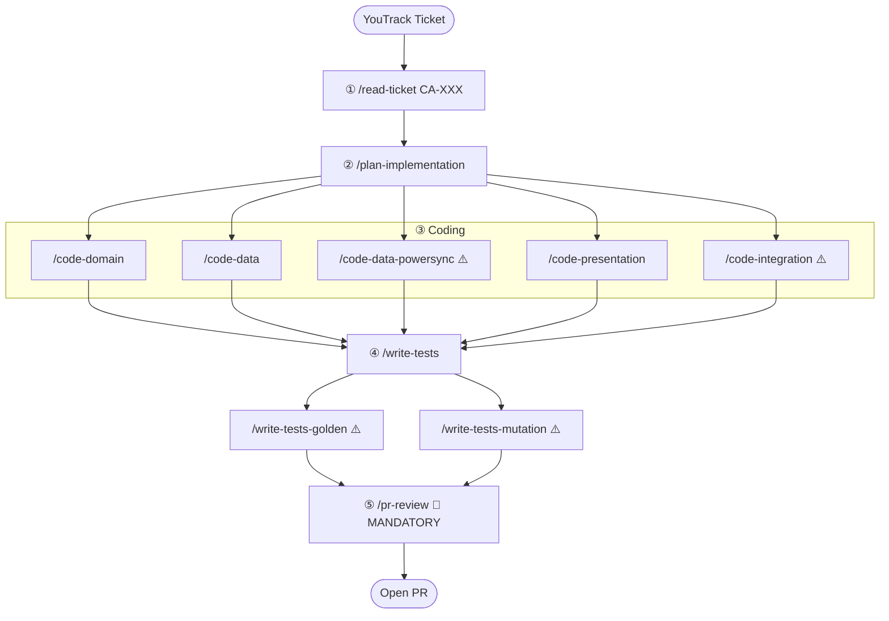

# Agentic Skills Plan: Story Lifecycle Edition

## Quick Setup

**1. YouTrack MCP.** Each developer sets this up once with a personal token.
Without it, `/read-ticket` asks you to paste the ticket text by hand instead.
That still works. It is only slower.

Follow the setup guide:
https://www.jetbrains.com/help/youtrack/cloud/model-context-protocol-server.html#remote-mcp-client

**2. Skills sit in `.claude/skills/`.** They ship with the repo, so a fresh
clone already has every skill. There is nothing to install. To confirm they
loaded, type `/` in Claude Code and look for `read-ticket`,
`plan-implementation`, and the others in the list.

---

## How to Run a Skill

Skills are **slash commands**. Type `/<skill-name>` and the agent loads that
skill's instructions.

```
/read-ticket CA-179
/plan-implementation
/code-presentation
/write-tests
/pr-review
```

This is the **standard way to run a skill**. It is explicit: you tell the
agent exactly which task it is doing right now, so it loads only that one
skill's instructions and nothing else.

> **Why a slash command beats a plain-English request.** Every skill's
> frontmatter also carries a plain-language description. The model can use
> that description to load a skill on its own, when a sentence you type
> matches it closely enough (`disable-model-invocation: false` allows this).
> This automatic loading is a convenience. It is not a guarantee: a slightly
> different sentence can miss the match, or match the wrong skill. Typing
> `/command` always loads the right skill. **Rule: run the workflow with
> slash commands. Treat automatic loading as a backup, not the plan.**

---

## Core Principle

When a coding agent, such as Cursor or Claude Code, runs a skill, it loads
the whole `SKILL.md` file into its context window. Every line in that file
uses tokens, even a line the agent does not need right now. A skill that
mixes unrelated behaviors makes the agent read past content it does not
need. That unrelated content can also make the agent copy the wrong pattern
for the current step.

The question to ask for every skill is: **what is the agent's one task right
now?**

Two questions decide where a skill's boundary sits:
1. Does every rule in this skill apply at the same point in the workflow?
2. Does the agent always run this skill, or only sometimes?

A "no" to either question is a signal to split the skill into two. The
number of skills a project ends up with is a result of asking these
questions, not a target picked in advance.

Skills are not advice for a human to read. They are **instructions
specific enough that the agent can follow them without asking a
clarifying question**, and produce correct code the first time.

---

## Skill Structure

```
.claude/skills/
├── read-ticket/              # Stage 1: Intake
├── plan-implementation/      # Stage 2: Planning
├── code-presentation/        # Stage 3: Coding — UI layer
├── code-domain/              # Stage 3: Coding — Domain layer
├── code-data/                # Stage 3: Coding — Data layer (Supabase, non-synced)
├── code-data-powersync/      # Stage 3: Coding — Data layer (PowerSync, offline-first, gated)
├── code-integration/         # Stage 3: Coding — 3rd party (gated)
├── write-tests/              # Stage 4: Testing — unit + widget (always)
├── write-tests-golden/       # Stage 4: Testing — screenshot (gated)
├── write-tests-mutation/     # Stage 4: Testing — mutation (gated)
└── pr-review/                # Stage 5: Review (mandatory)

.claude/rules/                # Shared: RULE_01-15, referenced by name
.claude/references/           # Shared: architecture-layers, coreui-api
```

Claude Code discovers `.claude/skills/` on its own. A fresh clone needs no
install step. `rules/` and `references/` sit next to `skills/`, not inside
it, because Claude Code only looks for `.claude/skills/*/SKILL.md`. Neither
`rules/` nor `references/` has its own `SKILL.md`, so neither one is a skill
you can run directly. They are shared knowledge that the coding and review
skills pull in by name. Each rule is written once and used in every skill
that names it. Fix a rule in one place, and every skill that names it gets
the fix.

---

## Workflow at a Glance


```mermaid
flowchart TD
    T([YouTrack Ticket]) --> R

    R["① /read-ticket CA-XXX"]
    R --> P

    P["② /plan-implementation"]
    P --> D & DA & PS & UI & INT

    subgraph S3["③ Coding"]
        D["/code-domain"]
        DA["/code-data"]
        PS["/code-data-powersync ⚠️"]
        UI["/code-presentation"]
        INT["/code-integration ⚠️"]
    end

    D & DA & PS & UI & INT --> WT

    WT["④ /write-tests"]
    WT --> WG & WM

    WG["/write-tests-golden ⚠️"]
    WM["/write-tests-mutation ⚠️"]

    WG & WM --> PR

    PR["⑤ /pr-review 🔴 MANDATORY"]
    PR --> O([Open PR])
```

> ⚠️ marks a gated skill. A gated skill has a condition attached. Run it only
> when that condition is met (see each stage below for its own condition).

---

## Slash Command Reference

Run each skill by typing its slash command. An argument, such as a ticket
id, goes after the command.

| Skill | Command | When to Run It |
|-------|---------|-----------|
| `read-ticket` | `/read-ticket CA-123` | Always |
| `plan-implementation` | `/plan-implementation` | Always |
| `code-domain` | `/code-domain` | When the story touches the domain layer |
| `code-data` | `/code-data` | Data layer, **non-synced** Supabase tables |
| `code-data-powersync` ⚠️ | `/code-data-powersync` | Data layer, **PowerSync-synced** (offline-first) tables. ⚠️ Not yet merged into `.claude/skills/`; see Known Gaps |
| `code-presentation` | `/code-presentation` | When the story touches UI |
| `code-integration` ⚠️ | `/code-integration` | Gated: a new external SDK |
| `write-tests` | `/write-tests` | Always |
| `write-tests-golden` ⚠️ | `/write-tests-golden` | Gated: layout-sensitive UI |
| `write-tests-mutation` ⚠️ | `/write-tests-mutation` | Gated: 3 or more branches |
| `pr-review` | `/pr-review` | Mandatory, before every PR |

---

## Stage 1: Ticket Intake

### `/read-ticket`

**Verb:** Understand what to build.

This is the agent's first action on a new story. It carries no coding rules.
Its only job is orientation, so every skill run after it starts with the
right context.

**What the agent does:**
- Reads the ticket and finds which architecture layers it touches
  (presentation, domain, data, integration)
- Identifies which new classes the story needs, and their rough job
- Guesses which test types the story will need (unit, widget, golden,
  mutation)
- Flags anything unclear in the ticket, and raises it to the developer
  before coding starts

**Output:** A shared understanding of the story that the planning skill
builds on next.

---

## Stage 2: Implementation Planning

### `/plan-implementation` *(always)*

**Verb:** Decide what to create.

This skill covers every decision the agent makes before writing the first
line of production code. Getting these decisions right here removes naming
and structure rework later.

**What the agent does:**
- Names every new class with the correct suffix: `UseCase`, `Service`,
  `Repository`, `Datasource` (RULE_2)
- Applies the abstraction-level naming rule: abstract names at the UI layer,
  explicit and concrete names at the data layer (RULE_11)
- Decides which files to create, and where each one sits in the layer
  structure
- Identifies any CoreUI component the story needs. If a component does not
  exist yet, the agent tells the developer before writing code, not after

**What the agent does not do:** write any implementation code. Planning and
coding are two separate tasks.

**Output:** A plan saved to `plans/CA-XXX-plan.md`, containing class names,
file paths, any CoreUI blockers, the PR split strategy, and which skills to
run next.

---

## Stage 3: Coding

The coding stage splits by architecture layer, because each layer has a
genuinely different set of concerns. The agent must load only the guidance
for the layer it is writing right now.

### `/code-presentation` *(always, when the story touches UI)*

**Verb:** Write a widget, screen, or BLoC.

The BLoC belongs here. It coordinates state for the screen. It does not
author business rules.

**Rules applied:**
- **RULE_4**: Use CoreUI components. Do not reach for a Material widget
  directly. If no CoreUI equivalent exists, ask the developer instead of
  substituting one silently.
- **RULE_5**: No business logic in a widget: no guard checks, no
  cross-state coordination, no calculation inline.
- **RULE_10**: Every user-facing string must use a localization key. No
  hardcoded text.
- **RULE_12**: State derivation belongs in the BLoC, not in the widget's
  build method.
- **RULE_7**: Write self-documenting code: a comment explains *why*, never
  *how*. No AI-generated placeholder comments.

---

### `/code-domain` *(always, when the story touches the domain layer)*

**Verb:** Write a use case and its repository contract.

These two travel together. In the same session, the agent states the
business intent (the use case) and defines the interface that use case
depends on (the repository contract). No implementation detail enters here.

**Rules applied:**
- **RULE_2 / RULE_11**: a use case class name describes the business intent.
  A repository interface is named at the right abstraction level.
- **RULE_5**: Pure business logic only. No data-source concerns, no
  Flutter framework imports, no Sentry calls.
- **RULE_7**: Write self-documenting code. Domain logic reads like a
  business rule, not like an algorithm.

**What does not live here:** stream lifecycle, error logging, SDK wiring.
Those belong in the layers below.

---

### `/code-data` *(when the story touches a non-synced data layer)*

**Verb:** Write a repository implementation or a datasource for a
**non-synced** Supabase table (request and response, through
`SupabaseWrapper`).

This is the bridge between the domain contract and the outside world (a
remote API, a local database, a device sensor). If the table is
**PowerSync-synced**, use `/code-data-powersync` instead. See the decision
gate below.

**Rules applied:**
- **RULE_2 / RULE_11**: Concrete, explicit naming: `RemoteUserDatasource`,
  not `UserDatasourceImpl`.
- **RULE_5**: A repository implementation turns a data error into a domain
  failure. It does not contain business rules.
- **RULE_6**: If the datasource exposes a stream, use `distinct()`, manage
  the `StreamController`'s lifecycle, and cancel it correctly on dispose.
- **RULE_15**: Sentry error logging lives here, for an unexpected data
  error. Log an error once. Do not log it again as it moves up the call
  stack. An expected error, such as a 404 or an empty result, is not a
  Sentry event.
- **RULE_7**: Write self-documenting code.

---

### `/code-integration` *(gated: a new 3rd-party service)*

**Verb:** Wire an external SDK into the app.

**Decision gate:** Run this only if the story adds a new external package or
service. If the story only uses an SDK that is already integrated, skip
this skill.

This is a separate task because the agent is not writing business logic or
UI here. It is building an integration boundary, and that boundary has its
own setup steps and its own ways to fail.

**What the agent does:**
- Sets up the SDK in the correct place (a DI module, never a widget or a
  use case)
- Wraps the SDK in an adapter, so the domain layer never imports it
  directly. The domain layer depends on the repository contract. The
  adapter implements that contract.
- Turns an SDK exception into a typed domain failure, at the adapter
  boundary
- **RULE_15**: Logs an unexpected SDK error to Sentry once, at the adapter
  layer only
- **RULE_2 / RULE_11**: Names the adapter and its contract at the correct
  abstraction level

---

### `/code-data-powersync` *(gated: PowerSync-synced tables)*

**Verb:** Write the data layer for an offline-first, PowerSync-synced table.

**Decision gate:** Use this **instead of `/code-data`** when the feature
reads or writes a table listed in
`lib/libraries/powersync/models/schema.dart`. For a non-synced Supabase
table, use `/code-data` instead.

This skill uses the same Clean Architecture layering and the same error
boundary (RULE_15) as `/code-data`. What differs is how the data moves: a
read is a reactive stream, and a write is an optimistic local change, all
behind the `PowerSyncDatabaseWrapper` seam (the interface a feature depends
on instead of the PowerSync SDK directly). This skill also tells the agent
how to set up the PowerSync configuration and sync streams for the feature.

**What the agent does:**
- Reads go through a `watch()` stream, so the UI stays live as data syncs
  in. A one-shot `getAll()` read is not the default.
- A write is an optimistic local change through `execute()`. Success here
  means "saved locally and queued for upload," **not** "the server accepted
  it."
- A multi-table atomic write uses `writeTransaction`.
- The DataSource owns activating the on-demand `syncStream`, and releases
  the handle when the subscription cancels. Nothing is left running.
- The agent never treats an empty stream as proof a permission was denied.
  Emptiness and denial look the same and mean different things.
- The agent checks the backend sync rules (schema-to-stream-`SELECT`
  parity, RLS, the Postgres publication) before the feature works end to
  end.
- **RULE_15**: RepositoryImpl is the error boundary. DataSource always
  rethrows.

> 🛑 When a write's *server acceptance* matters to the user's experience
> (locking a cost estimate, for example), the skill stops and asks the
> developer how to handle confirmation and conflict. The optimistic default
> does not fit every case.

---

## Stage 4: Testing

Testing splits by **when it runs**, not by how similar two test files look.
The agent always writes some tests. It writes others only when a condition
is met. Deciding which case applies is the main job of a gated testing
skill, so that logic cannot sit buried inside one combined test file.

### `/write-tests` *(always)*

**Verb:** Write unit and widget tests.

Unit and widget tests stay in one skill. They share the same Modular
dependency-injection setup and teardown, the same rule (fake only at the
lowest boundary), and a developer typically writes both in the same session
for one feature.

**Unit test side:**
- **RULE_3**: Fake the real implementation only at the lowest boundary. No
  mocks, no stubs.
- **RULE_9**: A test checks behavior: output, a state change, an emitted
  event. It never checks an internal implementation detail or how many
  times a method was called.
- Stream testing: use `expectLater` with a matcher. Do not `await` on each
  emission one at a time.

**Widget test side:**
- **RULE_8**: Use a finder tied to meaning: `find.byKey`, `find.text`.
  Never `byType`, and never a position-based finder like
  `findsNWidgets`.
- Use `pumpAndSettle` with care: avoid it for a Lottie animation or an
  indefinite stream. Prefer `pump(duration)` instead.
- **RULE_3**: Inject a fake through DI. Do not override a widget's
  constructor to do it.

---

### `/write-tests-golden` *(gated: layout-sensitive UI)*

**Verb:** Decide whether the story needs screenshot coverage, then write it.

**Decision gate:** Does this story add or change layout-sensitive UI? If no,
skip this skill. If yes, run it.

**What the agent does:**
- Sets up golden-test scaffolding with the correct device-frame
  configuration
- Covers the main visual state, when the screen works as intended
- **RULE_14**: For a critical user flow checked visually, adds an
  accessibility check in the same test pass (a semantic label, contrast, tap
  target size)

---

### `/write-tests-mutation` *(gated: logic-heavy changes)*

**Verb:** Decide whether the use case needs mutation testing, then run it.

**Decision gate:** Does the use case under test have 3 or more conditional
branches? If no, skip this skill. If yes, run it.

**What the agent does:**
- **RULE_13**: Runs mutation testing on the logic-heavy use case
- Confirms the test suite kills each generated mutant, meaning the tests
  actually check the logic and do not just execute the code path
- Reports a surviving mutant to the developer as a missing test case

---

## Stage 5: PR Review

### `/pr-review`

**Verb:** Check a finished diff for a rule violation.

> 🔴 **Run this before every PR.** Type `/pr-review` once the implementation
> and its tests are done.

This skill runs after the fact, on purpose. It does not replace the
construction-stage skills above it. Its job is to catch anything those
skills missed, not to be the main check on quality.

---

## Summary

| Skill | Stage | When to Run It | Rules Covered |
|---|---|---|---|
| `read-ticket` | Intake | Always | None |
| `plan-implementation` | Planning | Always | RULE_2, RULE_11 |
| `code-presentation` | Coding | Always (if layer touched) | RULE_4, RULE_5, RULE_7, RULE_10, RULE_12 |
| `code-domain` | Coding | Always (if layer touched) | RULE_2, RULE_5, RULE_7, RULE_11 |
| `code-data` | Coding | When layer touched (non-synced Supabase) | RULE_2, RULE_5, RULE_6, RULE_7, RULE_11, RULE_15 |
| `code-data-powersync` | Coding | Gated (PowerSync-synced table) | RULE_6, RULE_15 + stream/write/sync-config patterns |
| `code-integration` | Coding | Gated (new SDK) | RULE_2, RULE_11, RULE_15 + adapter patterns |
| `write-tests` | Testing | Always | RULE_3, RULE_8, RULE_9 |
| `write-tests-golden` | Testing | Gated (layout UI) | RULE_14 |
| `write-tests-mutation` | Testing | Gated (3+ branches) | RULE_13 |
| `pr-review` | Review | **Mandatory** | RULE_4, RULE_5, RULE_10 + others |

**11 skills in total.** Each one covers a single task, and each one loads
only what the agent needs at that point in the story.

---

## Chaining Skills

Stay in the **same Claude Code session** for an entire feature. Context
carries forward on its own, so you do not need to re-explain what was
planned when you move from planning to coding.

| Handoff | What carries forward |
|---------|---------------------|
| `read-ticket` → `plan-implementation` | Layers touched, expected classes, unclear points |
| `plan-implementation` → `code-*` | File paths, class names, PR split strategy |
| `code-*` → `write-tests` | Classes created, business logic to check |
| `write-tests` → `pr-review` | The full implementation, ready for review |

> If you start a **new session** partway through a feature, the plan is
> already saved at `plans/CA-XXX-plan.md`. Tell Claude to read it, and the
> context comes back.

---

## Good Practices for Running the Workflow

These habits keep the skill chain reliable instead of decorative.

**1. One task at a time.** Run the skill for the layer you are writing
*right now*. Do not run `/code-domain` and `/code-data` back to back without
a pause. Run one, let it finish, review it, then move to the next. Mixing
tasks is exactly what this structure exists to prevent.

**2. Never skip the gate check.** For a gated skill (`/code-integration`,
`/write-tests-golden`, `/write-tests-mutation`), ask its gate question out
loud before you run it: does this add a new SDK? Is the UI
layout-sensitive? Are there 3 or more branches? If the gate condition is not
met, skipping the skill is correct. It is not a shortcut.

**3. Plan before you code, every time.** `/plan-implementation` is cheap.
Reworking a name or a file structure later is not. A saved
`plans/CA-XXX-plan.md` is also your recovery point if the session ends
unexpectedly.

**4. Read the ticket first, even when it looks simple.** `/read-ticket`
catches a layer surprise, such as a "UI-only" ticket that quietly needs a
new datasource, before it turns into a detour in the middle of coding.

**5. `/pr-review` is a gate, not a formality.** Run it on every branch
before you open the PR. It is the *last* check, not the main one. The
construction-stage skills already catch most issues. A clean
`/pr-review` after a messy build means the review ran too shallow, not that
the code was perfect.

**6. Trust the layer boundaries.** If a rule feels wrong for your case,
raise it (see below). Do not quietly break it in one PR instead. A silent
exception in one PR becomes a pattern other PRs copy.

**7. Keep the workflow moving.** Ticket, then plan, then code (one layer at
a time), then tests, then review. Resist batching these steps together. A
small, digestible PR (RULE_1) gets reviewed fastest.

---

## Session Hygiene

- **One feature per session, where practical.** Context carries forward for
  free this way (see Chaining Skills).
- **Starting a new session partway through a feature?** Run `/read-ticket`
  again, then point Claude at `plans/CA-XXX-plan.md`. Two commands restore
  the context.
- **Prefer a slash command over a plain-English request.** Automatic loading
  is a convenience. `/command` is the guarantee. Be explicit when it
  matters.
- **Answer a skill's clarifying question in the same session.** Do not
  restart the session, or you lose the context it already had.

---

## Improving the Skills

The workflow is only as good as the instructions behind it. Treat a skill
file like code you maintain, not documentation you write once and forget.

When you see the **same rule broken across several PRs**, do not just leave
a comment. Fix the skill so the same mistake does not happen again:

1. **Create a YouTrack ticket** describing the repeated pattern, and which
   rule it breaks
2. **Name the relevant skill file** in the ticket (`.claude/rules/XX-rule.md`
   or the `SKILL.md` that missed it)
3. **Open a PR** that updates the skill with clearer guidance or a concrete
   example
4. **Tell the team** what changed

A violation that survives PR review becomes a skill update, not a repeated
comment.

---

## Known Gaps & Improvement Backlog

These are findings from the last skill audit. Pick one up when you touch
that area of the workflow.

- **A skill's frontmatter still advertises a "Trigger:" phrase.** Now that
  the standard way to run a skill is `/command`, that line is stale. It
  invites someone to type a plain-English phrase, and that phrase can fail
  to load the skill. Rewrite each skill's `description` to describe *when
  the model loads it on its own*, and drop the "say this exact phrase"
  framing. The slash command is the real way in.
- **`/code-data-powersync` is not yet inside `.claude/skills/` with the
  others.** The skill file exists, but it sits outside the `.claude/skills/`
  folder. Move it there so it loads and lists next to the rest of the
  workflow.
- **A gate's condition lives only in prose.** For the three gated skills,
  consider having the skill's *first step* restate its own gate and refuse,
  with a one-line reason, when the condition is not met. That way, a
  mis-fired `/write-tests-mutation` on a use case with one branch stops
  itself instead of running anyway.
- **No skill owns "set up dependency injection."** Right now this task is
  split, without being stated, across `code-data` and `code-integration`.
  Watch whether a DI mistake keeps coming up in review. If it does, that is
  a sign this needs its own task.

When you close one of these, delete its line in the same PR, so the backlog
matches reality.
